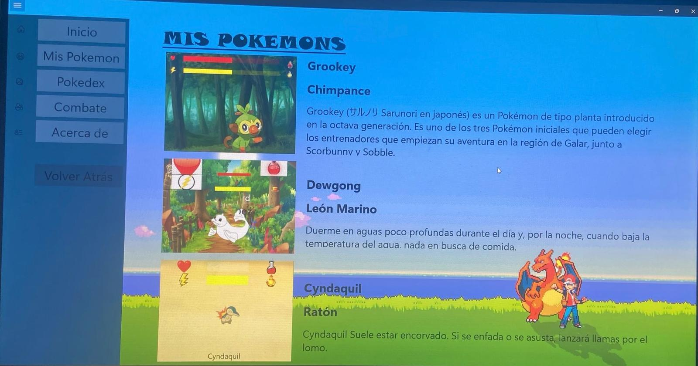

[![Forks][forks-shield]][forks-url]
[![Stargazers][stars-shield]][stars-url]
[![Issues][issues-shield]][issues-url]

# IPOkemon - Combate Pokémon

Prototipo de una aplicación de escritorio basada en UWP que permite simular combates entre Pokémon. Este proyecto fue desarrollado como parte de una práctica grupal para la asignatura de Interacción Persona-Ordenador II.

---

## Tabla de Contenidos
1. [Descripción General](#descripcion-general)
2. [Requisitos del Proyecto](#requisitos-del-proyecto)
3. [Características del Sistema](#caracteristicas-del-sistema)
4. [Tecnologías Utilizadas](#tecnologias-utilizadas)
5. [Cómo Ejecutar el Proyecto](#como-ejecutar-el-proyecto)
6. [Contacto](#contacto)

---

## Descripción General

El proyecto consiste en una aplicación para coleccionar y combatir Pokémon, implementada en UWP utilizando C# y XAML. La funcionalidad principal incluye:

- **Acceso a tus pokemons u pokedex**:
  - Selecciónd de pokemon.
  - Ver información del pokemon.
- **Combates entre Pokémon**:
  - Modo "Jugador vs Máquina".
  - Modo "Jugador vs Jugador".
- **Mecánicas de combate por turnos**:
  - Selección de movimientos y estrategias.
  - Resolución de turnos y cálculo de daño basado en estadísticas de los Pokémon.

(<a href="#">volver arriba</a>)

---

## Requisitos del Proyecto

El proyecto cumple con los siguientes requisitos:

1. **Guías de Estilo Fluent Design**:
   - Diseño adaptativo y navegación fluida, siguiendo las recomendaciones de Fluent Design para Windows 10/11.

2. **Funcionalidad de Combate**:
   - Simulación completa de combates Pokémon con lógica de turnos y visualización de estadísticas.

3. **Integración con UWP**:
   - Uso de controles avanzados de WinUI v2/v3.

(<a href="#">volver arriba</a>)

---

## Características del Sistema

- **Acceso información de pokemons registrados**:
  - Selecciónd de pokemon y animaciones.
  - Iformación detallada del pokemon seleccionado.
- **Combate Pokémon**:
  - Estadísticas dinámicas para cada Pokémon.
  - Animaciones simples para los ataques.
- **Opciones de juego**:
  - Elección de Pokémon iniciales.
  - Modo multijugador local (dos jugadores en la misma aplicación).
- **Accesibilidad**:
  - Internacionalización en español e inglés.
  - Compatibilidad con dispositivos táctiles y de escritorio.

(<a href="#">volver arriba</a>)

---

## Tecnologías Utilizadas

1. **Lenguajes y Frameworks**:
   - C#
   - XAML
   - UWP (Universal Windows Platform)

2. **Controles de UI**:
   - WinUI v2/v3.

3. **Principios de Diseño**:
   - Fluent Design System para interfaces adaptativas y modernas.

(<a href="#">volver arriba</a>)

---

## Cómo Ejecutar el Proyecto

1. **Requisitos previos**:
   - Tener instalado Visual Studio 2022 con las siguientes configuraciones:
     - Desarrollo de aplicaciones UWP.
     - Herramientas para C#.

2. **Descargar el proyecto del repositorio**:
   - Descargar y configurar el proyecto en tu aplicacion de Visual Stucio Community 2022.

3. **Por último ejecutar el proyecto**:
   - Una vez abierto el proyecto, ejecutarlo.
   - Si hay algún problema al abrir el proyecto, compilar > compilar solución.

---

## Contacto

Equipo de Desarrollo:
- Jesús García-Peñuela Molina-Prados
- David Alegre López de la Franca 
- Javier Alcaide Cea
  
Correo Electrónico: [jesuusgpmp14.2002@gmail.com](mailto:jesuusgpmp14.2002@gmail.com)

(<a href="#">volver arriba</a>)

---

[forks-shield]: https://img.shields.io/github/forks/JESUSGPMP14/EsiTube-Multimedia.svg?style=for-the-badge
[forks-url]: https://github.com/JESUSGPMP14/EsiTube-Multimedia/network/members
[stars-shield]: https://img.shields.io/github/stars/JESUSGPMP14/EsiTube-Multimedia.svg?style=for-the-badge
[stars-url]: https://github.com/JESUSGPMP14/EsiTube-Multimedia/stargazers
[issues-shield]: https://img.shields.io/github/issues/JESUSGPMP14/EsiTube-Multimedia.svg?style=for-the-badge
[issues-url]: https://github.com/JESUSGPMP14/EsiTube-Multimedia/issues